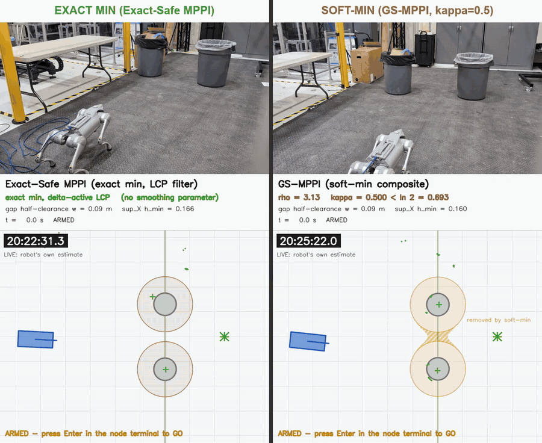

# Exact-Safe MPPI: Safety-Aware Sampling with Nonsmooth Control Barrier Functions

**Alex Coker and Leilei Cui**
Department of Mechanical Engineering, University of New Mexico
*Submitted to the American Control Conference (ACC) 2027*

[](LICENSE)
[](https://github.com/alexkcoker/exact-safe-mppi/actions/workflows/ci.yml)
[](https://www.python.org/)

<a href="media/videos/hardware_exact_vs_softmin.mp4"></a>

*Left: exact min (Exact-Safe MPPI) threads the gap. Right: soft-min (GS-MPPI, κ = 0.5 < ln 2) deadlocks. Top: real robot. Bottom: the planner's live view (robot's own estimate). Click for the full-quality mp4.*

## Abstract

Exact-Safe MPPI enforces the exact minimum of multiple (high-order) control barrier functions
inside every MPPI rollout using a closed-form linear complementarity (LCP) filter. This avoids
the certified-set shrinkage of the soft-minimum composition used by GS-MPPI, which can close
feasible gaps and cause deadlock below the threshold κ_crit = ln k.

**Key results**

- Below κ_crit the soft-minimum planner does not thread the gap in **0 of 1050** runs, and its
  failure mode is deadlock rather than constraint violation.
- The LCP filter reduces to the scalar law exactly when one constraint is active: maximum
  difference **8.9×10⁻¹⁶** over 10,030 sampled states.
- On the nine-constraint map the exact composition records **0 violations in 400 runs**, against
  **34** and **53** for the soft minimum at ρ = 200 and ρ = 1000.

## Videos

Each preview below is a looping GIF that plays here in the README, no click and no navigation.
Click one to open the full-quality mp4 in `media/videos/`. Both are tracked by git.

| Preview | Content |
|---|---|
| <a href="media/videos/teaser.mp4"></a> | Soft-min vs exact, disk gap |
| <a href="media/videos/disk_gap_softmin_rho1_deadlock.mp4"></a> | Disk gap w=0.12, ρ=1 (κ=0.606 < ln 2): soft min halts |
| <a href="media/videos/disk_gap_exact_threads.mp4"></a> | Disk gap w=0.12: exact composition threads the gap |
| <a href="media/videos/box_gap_softmin_vs_exact.mp4"></a> | Rounded-square gap (p=8): soft min vs exact |
| <a href="media/videos/nine_constraint_exact_safe.mp4"></a> | Nine-constraint map: Exact-Safe MPPI |
| <a href="media/videos/nine_constraint_softmin_rho200.mp4"></a> | Nine-constraint map: soft min, ρ=200 |
| <a href="media/videos/nine_constraint_shield.mp4"></a> | Nine-constraint map: discrete-time repair baseline |
| <a href="media/videos/kmax1_ablation_chattering.mp4"></a> | Single most-active constraint (k_max=1): chattering |

## Installation

```bash
# pip
python -m pip install -r requirements.txt
python -m pip install -e .

# conda
conda env create -f environment.yml
conda activate exact-safe-mppi
python -m pip install -e .
```

## Quick start

```bash
make quick        # every experiment, 3 seeds and a reduced grid
```

## Full reproduction

```bash
make reproduce                 # serial
make reproduce WORKERS=8       # parallel; results are identical for any WORKERS
```

Every run is seeded as `seed = base_seed + run_index`, and the seed is written into each output
row, so `--workers` changes only the wall time.

| Paper item | Command | Output |
|---|---|---|
| Fig. 1, Table I | `python experiments/gap_threshold.py` | `results/gap_threshold/{runs,table1}.csv`, `table1.tex`, `figures/fig1_gap_threshold.pdf` |
| Fig. 2 | `python experiments/fig2_median_runs.py` | `results/fig2_median_runs/`, `figures/fig2_median_runs.pdf` |
| Closed-form checks | `python experiments/closed_form_checks.py` | `results/closed_form_checks/closed_form_checks.json` |
| LCP vs scalar law | `python experiments/lcp_vs_scalar.py` | `results/lcp_vs_scalar/lcp_vs_scalar.json` |
| Nine-constraint safety | `python experiments/nine_constraint.py` | `results/nine_constraint/{runs.csv,summary.json}` |
| k_max ablation | `python experiments/kmax_ablation.py` | `results/kmax_ablation/{runs.csv,summary.json}` |
| Verification | `python scripts/verify_results.py` | PASS/FAIL table on stdout |
| Figures only | `make figures` | reads `results/*/runs.csv`, rewrites `figures/`; reruns nothing |

**Runtime.** `make quick` is **measured at 9.7 minutes** on one core (Xeon-class server,
`--workers 1`):

| Experiment | quick (measured) | full scale (estimate) |
|---|---|---|
| `closed_form_checks` | 17 s | 17 s |
| `lcp_vs_scalar` | 2 s | ~2 min |
| `gap_threshold` | 134 s | **~47 h** (4950 runs x 34 s) |
| `fig2_median_runs` | 30 s | ~1 h |
| `nine_constraint` | 195 s | **~26 h** (2800 runs) |
| `kmax_ablation` | 201 s | ~7 h |

The full-scale column is an **estimate**, extrapolated from the measured cost of one
closed-loop run (2.8 s per simulated second) times the run count; it is not a measurement.
Use `make reproduce WORKERS=N` — the full sweep is embarrassingly parallel and each run is
seeded independently, so any `N` gives identical results.

Quick mode uses one gap width per geometry, three seeds, and a shortened horizon
(`quick_run_length_T: 2.0` in each config). It is a smoke test, **not** a reduced-scale
reproduction: at that horizon runs have not settled, so the outcome *rates* in Table I are not
meaningful and `scripts/verify_results.py --quick` reports them as SKIP rather than comparing
them.

## Repository structure

```
src/exact_safe_mppi/   dynamics, barriers, composition, the three filters, MPPI, environments
configs/               one YAML per experiment; every value taken from the experiment code
experiments/           one script per paper result
scripts/               reproduce_all.sh, verify_results.py, render_video.py
tests/                 pytest: Lemma 3, two-barrier slice, Theorem 1(iii), LCP validity,
                       Proposition 1, determinism
results/expected/      the paper's reported numbers, used by verify_results.py
media/videos/          one mp4 per simulation clip (reference quality)
media/gifs/            the looping previews embedded in this README
```

## Outcome definitions

Every gap run is classified exactly as in the source experiment code
(`gap_threshold.py:one`, matching `r5_gap_threading.py:run_one`). Let `q` be the position
trace, `w` the gap half-width and `minh = min_t min_j h_j`.

```
crossed    = (q_x > 0.5).any()
qy_at_gap  = |q_y| at the sample minimising |q_x|          # closest approach to the gap
threaded   = crossed and qy_at_gap <= w + 0.15
speed      = max |velocity components| over the last 20 samples
violation  = minh < -1e-9
deadlock   = (not threaded) and (minh >= -1e-9) and (speed < 0.3)
moving     = (not threaded) and (not deadlock) and (not violation)
```

**Why threading requires passing through the gap.** Reaching `q_x > 0.5` is not enough. The
obstacles are finite, so a detour *around* them also reaches the goal, and counting those as
successes inverts the trend the experiment is measuring: box runs at ρ = 0.5 "succeeded" with
`|q_y| = 2.85` at the crossing, against an obstacle extent of 2.05 — they went around a barrier
that had closed the gap, and low ρ therefore looked *good*. A run counts as threaded only if its
closest approach to `x = 0` lies inside the gap itself.

**Deadlock is separated from violation** because both fail the task but only one is the effect
being measured: deadlock is a run that never violates a constraint and comes to rest, which is
the soft minimum being excluded from a region it should be able to reach. The `1e-9` slack in
`minh` is the numerical tolerance used throughout, including the nine-constraint and ablation
experiments.

## Citation

```bibtex
@inproceedings{coker2027exactsafe,
  title     = {Composing Exact Barriers Inside an MPPI Planner},
  author    = {Coker, Alex and Cui, Leilei},
  booktitle = {Submitted to the American Control Conference (ACC)},
  year      = {2027}
}
```

See `CITATION.cff` for the machine-readable form.

## License and contact

MIT, see [LICENSE](LICENSE).

Alex Coker and Leilei Cui, Department of Mechanical Engineering, University of New Mexico.
